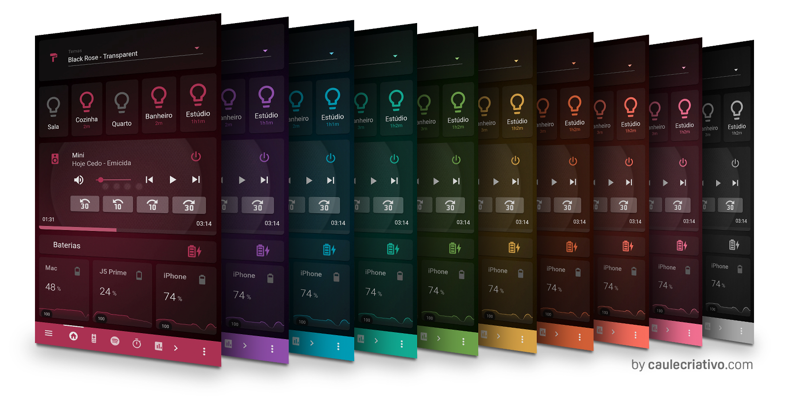
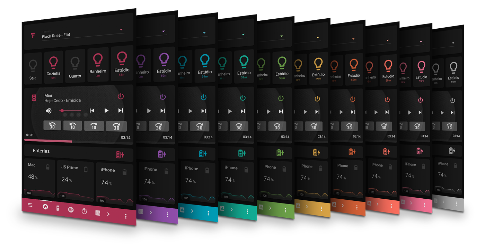
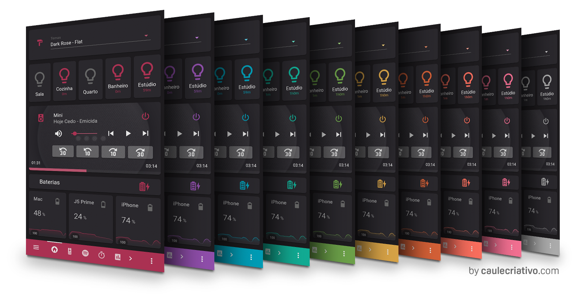
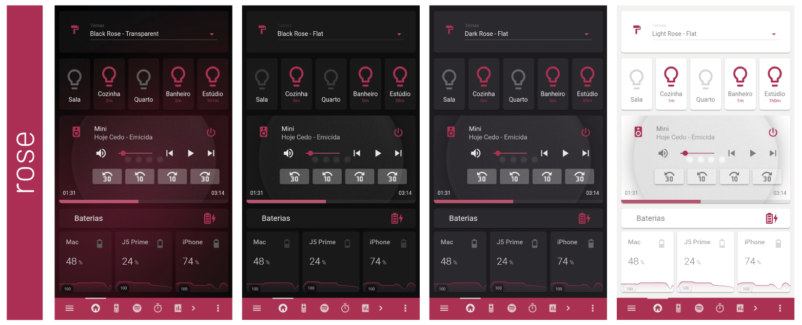
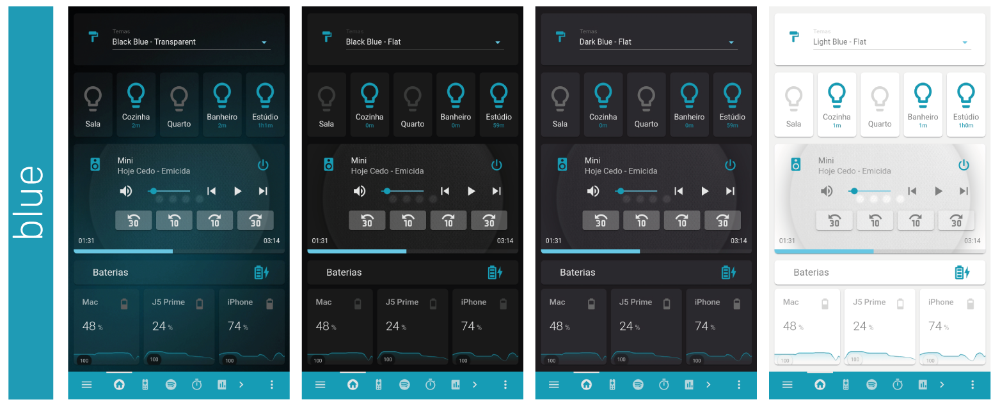
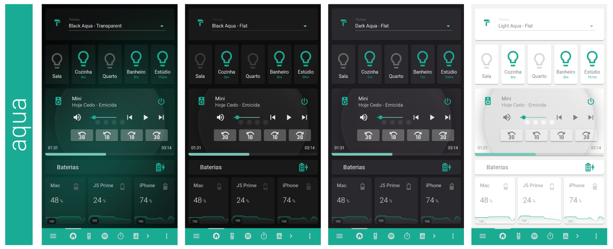
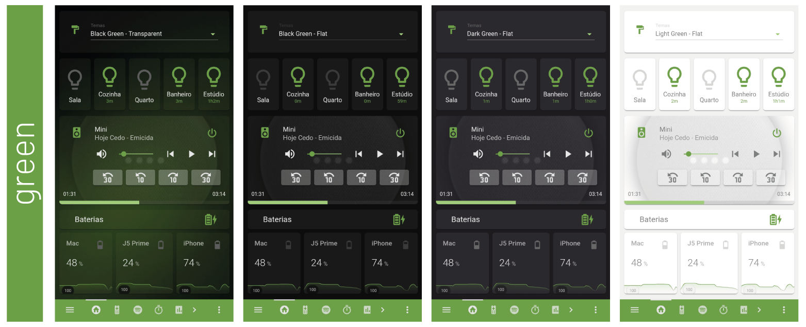
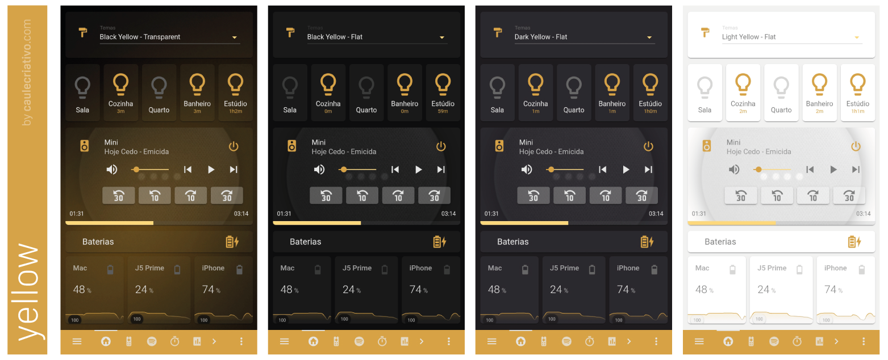
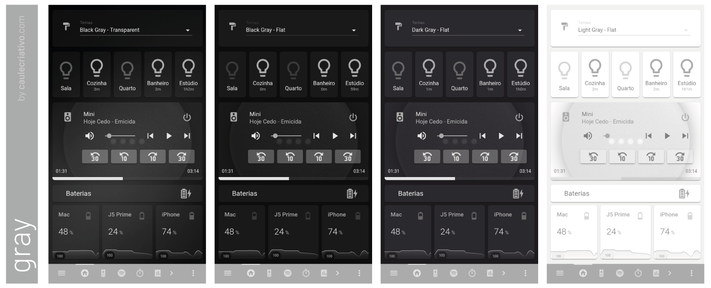

# Caule Themes Pack 1.1 - by caulecriativo.com

[](https://github.com/custom-components/hacs)
[](https://forum.homeassistantbrasil.com.br/t/themes-pack-2-0-by-caulecriativo-com/1422)
[](http://habr.ml)
[](https://community.home-assistant.io/t/themes-pack-2-0-by-caulecriativo-com/209436)
[](https://github.com/orickcorreia/caule-themes-pack-1.1)
[](https://github.com/orickcorreia)


[Versão em Português](README-PT-BR.md)

Created by Ricardo Correia for the Home Assistant Brasil community.
<br> There are 10 modern cores, totaling 40 different themes!

I want to ask only 2 things for those who benefit from these themes:

1) Join the HABR community on Discord: [habr.ml](http://habr.ml)
2) Follow my creative studio on instagram: [caulecriativo.com](http://caulecriativo.com)

Make good use of themes ☺️


















# Installation of themes

## If you already have a themes.yaml file

So just copy the code or download **themes.yaml** [**clicking here**](https://github.com/orickcorreia/ha-themes-pack-2.0/blob/master/src/en/themes.yaml).


## If you DO NOT STILL have a themes.yaml file

Then you need to configure your **configuration.yaml** file, adding the code below for your Home Assistant to search for themes in the **themes.yaml** file:

```
frontend:
  themes: !include themes.yaml
```

After entering the configuration in your **configuration.yaml**, download the file **themes.yaml** [**clicking here**](https://raw.githubusercontent.com/orickcorreia/ha-themes-pack-2.0/master/src/en/themes.yaml) and copy this file to your **config** folder. The **themes.yaml** file must be in the same folder as the **configuration.yaml** file.


## Download backgrounds
10 of the 40 themes have backgrounds that need to be downloaded and copied to your Home Assistant server. Download the backgrounds [**clicking here.**](https://github.com/orickcorreia/ha-themes-pack-2.0/raw/master/src/backgrounds.zip) Extract the file **.zip** and copy the **backgrounds** folder into the **config/www/** folder. The final path to the file folder should be **config/www/backgrounds/**


*ATTENTION! If your **www** folder does not yet exist, create it within the **config** folder.*


Now **restart your Home Assistant** and the themes will be available for use.


# Creating an automatic theme selector for the interface (optional)

We will create a theme selector to be implemented in your user interface. It is a practical way to change the theme instantly on all devices connected to your Home Assistant. See how it works in the gif below:


## 1st Step - Creating the input_select
The input_select will be used to create the selection list with the themes that I created. <br>
Insert this code into your file **configuration.yaml** <br>
If you've never used input select, [learn more by clicking here.](https://www.home-assistant.io/integrations/input_select)


```
input_select:

  themes:
    name: 'Themes'
    icon: mdi:format-paint
    options:
      - Black Rose - Flat
      - Black Purple - Flat
      - Black Blue - Flat 
      - Black Aqua - Flat
      - Black Green - Flat
      - Black Yellow - Flat
      - Black Orange - Flat
      - Black Coral - Flat
      - Black Pink - Flat
      - Black Gray - Flat
      - Dark Rose - Flat
      - Dark Purple - Flat
      - Dark Blue - Flat 
      - Dark Aqua - Flat
      - Dark Green - Flat
      - Dark Yellow - Flat
      - Dark Orange - Flat
      - Dark Coral - Flat
      - Dark Pink - Flat
      - Dark Gray - Flat
      - Light Rose - Flat
      - Light Purple - Flat
      - Light Blue - Flat 
      - Light Aqua - Flat
      - Light Green - Flat
      - Light Yellow - Flat
      - Light Orange - Flat
      - Light Coral - Flat
      - Light Pink - Flat
      - Light Gray - Flat
      - Black Rose - Transparent
      - Black Purple - Transparent
      - Black Blue - Transparent 
      - Black Aqua - Transparent
      - Black Green - Transparent
      - Black Yellow - Transparent
      - Black Orange - Transparent
      - Black Coral - Transparent
      - Black Pink - Transparent
      - Black Gray - Transparent      
      - Default
```
Restart your Home Assistant so that the input_select is created.


Result:
* input_select.themes


## 2rd Step - Automation of the theme selector in Node-RED

**WARNING!** If you've never used Node-RED, [learn more by clicking here.](https://github.com/hassio-addons/addon-node-red)


We will create a flow in Node-RED to define the theme automatically every time you choose a theme in your interface. It's very simple! Just download the .json file or copy the code and paste it into the Node-RED import window.

[Click here to copy or download the code for Node-RED flows](https://raw.githubusercontent.com/orickcorreia/ha-themes-pack-2.0/master/src/seletor_theme_nodered.json)


After importing the flow to your Node-RED, click **Deply** <br> <br>

## 3rd Step - Implementing the selector in your interface

Now just insert the selector code in your interface.
* If you use the interface in YAML Mode, copy the code and insert it into your **ui-lovelace.yaml**
* If you use the interface in automatic mode, go to the editing mode of your interface, choose the "manual" option at the end, then copy and paste the code below.

``` 
- type: entities
  show_header_toggle: false
  entities:
    - entity: input_select.themes

``` 

## 4rd Step - Setting the theme "Backend-selected"

Change the theme in the user's profile to "Backend-selected". This way, all connected devices with the theme "Backend-selected" will have their themes changed synchronously with the theme selector you just created.


### Now just enjoy it!
### If everything goes well, [send a print](http://api.whatsapp.com/send?phone=5565999593909) ☺️
